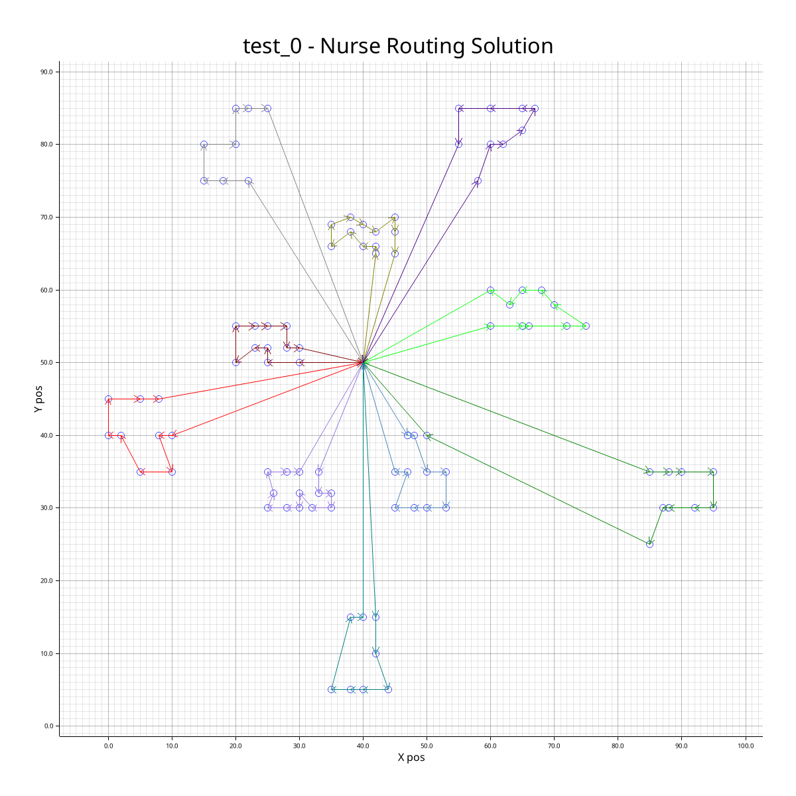
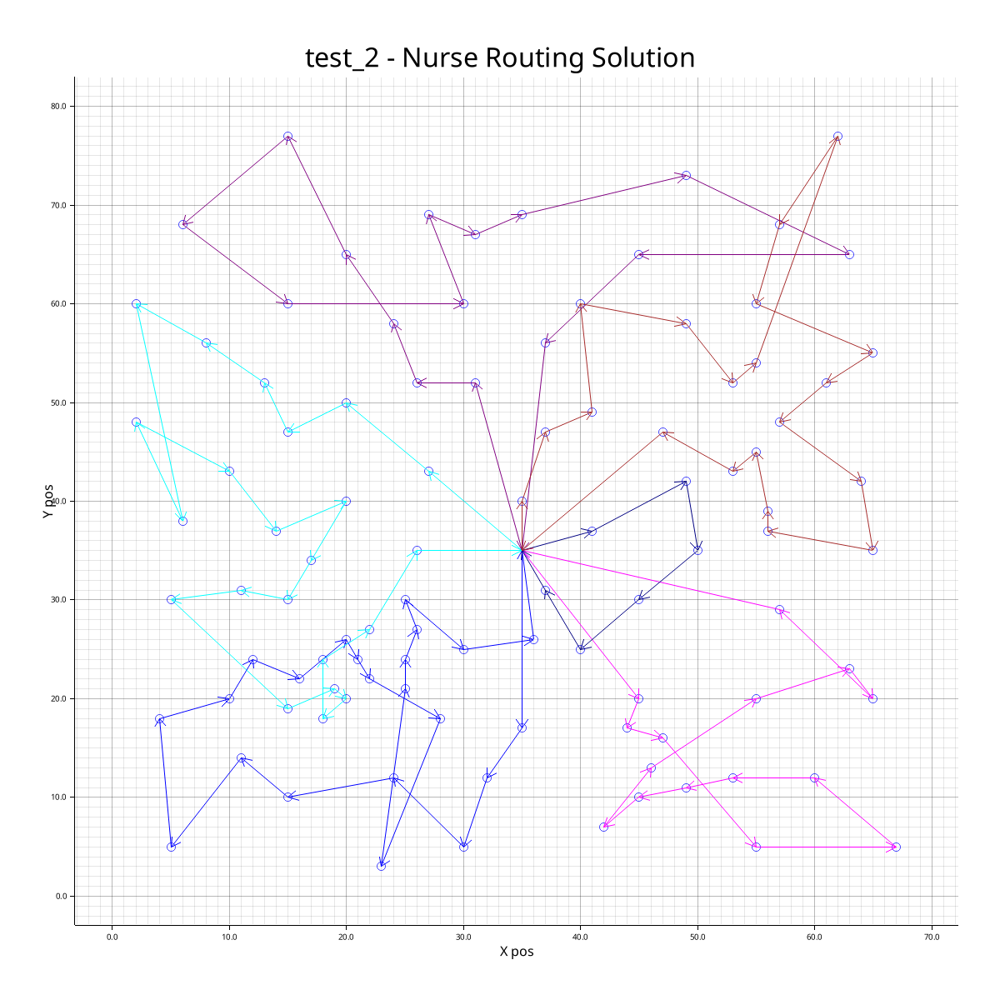

# IT3708 - Project 2: Memetic Genetic Algorithm

A Memetic Genetic Algorithm implementation in Rust for solving nurse routing problems. 
Achieved competitive results on benchmark datasets (e.g., 859.3904 on train_9), and second place in the course competition.
Key features include heuristic operations and optimization, parallelization, and adaptive population management.

## Table of Contents
- [Installation Prerequisites](#installation-prerequisites)
- [Usage](#usage)
- [Algorithm Overview](#algorithm-overview)
- [Configuration](#configuration)
- [Key Components](#key-components)
- [Results](#results)
- [License](#license)

## Installation Prerequisites
[Rust](https://www.rust-lang.org/tools/install) is required to run this project.

## Usage
### Run the program
To run the program, use this command:
```zsh
cargo run --release
```

### Configuration
This program can be configured by changing the [config.yaml](config/config.yaml) file.
Each field is (mostly) self-explanatory.

## Algorithm Overview
### Population Initialization
- **Feasible Instantiation**: Tries to construct feasible individuals for the population. Sometimes it "fails" and creates infeasible individuals instead. This is fine as having both feasible and infeasible solutions is often good in these kinds of problems
- **File Instantiation**: Loads pre-saved high-quality individuals

### Parent Selection
- **Linear Ranking**: Primary method using rank-based probabilities ($s=1.8$ typically)
- **Fitness-proportionate**: Simple, but one individual quickly takes over the entire population
- **Tournament selection**: Use a tournament with configurable size. Only deterministic selection for now

### Crossover (Visma Variant)
1. Remove some patients from each parent based on their structure
2. Repair via optimal insertion testing

### Mutation Operators
- **Primary**: Heuristic cluster and swap mutations
- **Secondary**: Random swap, insert, and destroy-repair mutations

### Child Selection
- Uses $(λ+μ)$ strategy with crowding-based similarity metrics

### Restart Mechanisms
- **Hard Restart**: Full population reinitialization
- **Soft Restart**: Worse results than hard restart

### Elitism
- Preserves top n individual between generations

### Parallelization
- **Islands Model**: Gives faster convergence
- **Multithreading**: Simple Rayon-based loop parallelization

## Key Observations
1. Maintains mixed feasible/infeasible population
2. Mutation-free runs achieved 5% margins in early tests
3. Crowding is critical for diversity maintenance

## Results
To get the best grade in the project, each test instance had to be within 5% of the benchmark margins.
Each test was run for a very short amount of time, but with varying hyperparameters. 
Notably, having too low fitness_punishment_factor makes all the best solutions infeasible, meaning no good feasible solutions are saved.

| Dataset  | Best Score | Benchmark Margin |
|----------|------------|-------------------|
| test_0   | 828.0649   | <5%               |
| test_1   | 1576.1025  | <5%               | 
| test_2   | 930.9652   | <5%               |

## Graphs
Some of the graphs look strange due to tight time windows.
The fitness is based only on travel time, not total time.




